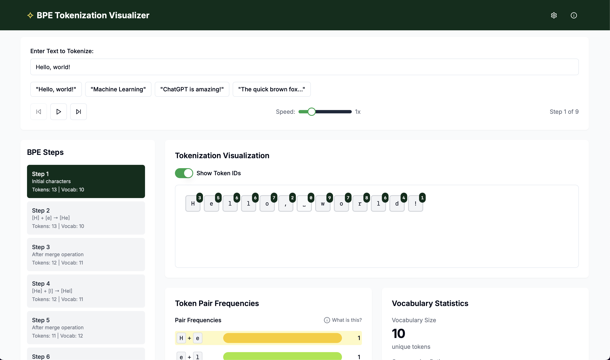

# BPE Tokenization Visualizer

[Website](https://simonrueba.com) · [GitHub](https://github.com/simonrueba)

An interactive web application for visualizing the Byte Pair Encoding (BPE) algorithm used in modern language model tokenization. Explore each merge step, inspect token frequencies, and view vocabulary growth in real time.



## Features

- **Step-by-Step Visualization**: Watch BPE merge operations unfold one by one or auto-play at adjustable speeds.
- **Token Display**: See the sequence of tokens and merged pairs highlighted in context.
- **Frequency Table**: Inspect pair frequencies at each step to understand merge decisions.
- **Vocabulary Statistics**: Track vocabulary size and compression ratio over time.
- **Current Vocabulary Panel**: Browse all tokens in the vocabulary with their indices.
- **Preset Examples**: Quickly load sample texts like "Hello, world!", "Machine Learning", "ChatGPT is amazing!", and "The quick brown fox...".
- **Algorithm Parameters**: Tweak \(max merges, min frequency, case sensitivity, inclusion of spaces/punctuation\) via settings panel.
- **Info Panel**: Learn the theory behind BPE tokenization without leaving the app.

## Tech Stack

- **Framework**: Next.js 15 (App Router)
- **Language**: TypeScript & React 19
- **Styling**: Tailwind CSS & shadcn/ui components
- **Charts & UI**: Recharts, Radix UI, Lucide icons
- **State Management**: React hooks

## Installation

1. Clone this repository:

   ```bash
   git clone https://github.com/simonrueba/bpe-visualization.git
   cd bpe-visualization
   ```

2. Install dependencies (using pnpm, npm or yarn):

   ```bash
   pnpm install  # or npm install, yarn install
   ```

3. Run in development mode:

   ```bash
   pnpm dev
   ```

4. Open your browser at `http://localhost:3000` to explore the visualizer.

To create a production build and serve:

```bash
pnpm build
pnpm start
```

## Usage

- **Input Text**: Type or paste any text in the input field.
- **Navigation Controls**: Step forward/backward, play/pause, or skip through merge operations.
- **Speed Slider**: Adjust auto-play speed from 0.5× to 3×.
- **Settings**: Click the ⚙️ icon to open the parameters panel and customize algorithm behavior.
- **Info**: Click the ℹ️ icon to view background on BPE tokenization.
- **Sidebar**: Jump directly to any merge step in the side panel.

## Algorithm Parameters

| Parameter           | Description                                                          | Default |
| ------------------- | -------------------------------------------------------------------- | ------- |
| Max Merge Operations| Maximum number of merge operations to perform                        | 15      |
| Min Pair Frequency  | Minimum frequency threshold for eligible merge pairs                 | 1       |
| Include Spaces      | Whether to treat spaces as tokens                                    | true    |
| Include Punctuation | Whether to include punctuation characters as tokens                  | true    |
| Case Sensitive      | Whether tokenization is case-sensitive                               | true    |

## Contributing

Contributions are welcome! Please follow these steps:

1. Fork the repository.
2. Create a new branch (`git checkout -b feature/YourFeature`).
3. Make your changes and commit (`git commit -m "Add awesome feature"`).
4. Push to the branch (`git push origin feature/YourFeature`).
5. Open a Pull Request describing your changes.

## License

MIT License

Copyright (c) 2025 Simon Rüba

Permission is hereby granted, free of charge, to any person obtaining a copy of this software and associated documentation files (the “Software”), to deal in the Software without restriction, including without limitation the rights to use, copy, modify, merge, publish, distribute, sublicense, and/or sell copies of the Software, and to permit persons to whom the Software is furnished to do so, subject to the following conditions: [opensource.org](https://opensource.org/license/mit)

The above copyright notice and this permission notice shall be included in all copies or substantial portions of the Software.

---

© 2025 Simon Rüba. All rights reserved.

